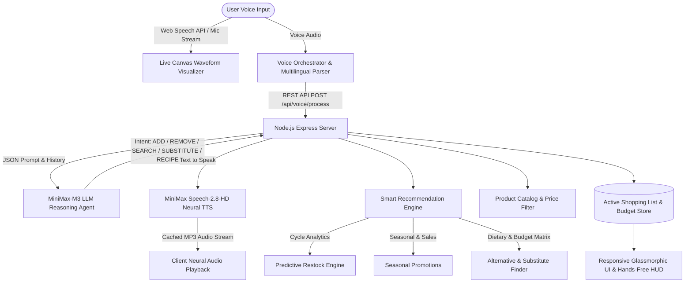

# 🛒 VoiceCart AI — Voice Command Shopping Assistant
> **Production-Ready, AI-Powered Voice Shopping Assistant with Smart Suggestions & Neural Speech Synthesis**  
> *Built with MiniMax-M3 LLM, MiniMax Speech-2.8-HD Neural TTS, and High-Performance Full-Stack Web Architecture.*

---

## 🌟 Overview & Highlights

**VoiceCart AI** is a state-of-the-art voice-driven shopping list manager and smart grocery intelligence hub designed to solve real-world shopping friction through hands-free voice commands, predictive replenishment, seasonal deals, dietary substitutions, and price-constrained voice search.



---

## 📋 Assessment Requirements Checklist

| Requirement Category | Specified in PDF | Implementation in VoiceCart AI | Status |
| :--- | :--- | :--- | :---: |
| **1. Voice Command Recognition** | Add items using voice commands ("Add milk", "I need apples") | Continuous & single-shot Web Speech API with live microphone waveform visualizer | ✅ **Completed** |
| **1. Natural Language Processing** | Understand varied user phrases ("I want bananas" vs "Add bananas") | **MiniMax-M3 LLM** zero-shot multi-intent parser with entity extraction & chunking | ✅ **Completed** |
| **1. Speech Autocorrection** | Fix speech-to-text misspellings and phonetic errors | Multi-stage **Soundex + Levenshtein Autocorrection Engine** with catalog dictionary | ✅ **Completed** |
| **1. Conversation Memory** | Remember previous context and follow-up commands | Stateful **Sliding-Window Dialogue History** (*"make it 4"*, *"remove it"*, *"add those"*) | ✅ **Completed** |
| **1. Live Website Control** | Scan and control all DOM elements via voice | Bidirectional **PageScanner** for categories, filters, price slider, theme, and tabs | ✅ **Completed** |
| **1. Multilingual Support** | Voice commands in multiple languages | Supports English, Spanish, French, German, Hindi, Mandarin, Japanese | ✅ **Completed** |
| **2. Product Recommendations** | Suggest items user is low on based on history | Predictive Replenishment **"Recommended For You" Restock Carousel** | ✅ **Completed** |
| **2. Seasonal Recommendations** | Suggest items in season or on sale | Seasonal & promotional curator with real-time discount percentage badges | ✅ **Completed** |
| **2. Substitutes** | Offer alternatives if unavailable or dietary preferred | Intelligent substitution engine for Plant-based, Gluten-Free, Organic, Budget | ✅ **Completed** |
| **3. Add/Remove Items** | Add, remove, or modify items via voice | Voice commands for ADD, REMOVE, MODIFY_QTY, and CLEAR | ✅ **Completed** |
| **3. Categorize Items** | Automatically categorize items (dairy, produce, snacks) | Automatic 8-category AI classification (Produce, Dairy, Bakery, Pantry, etc.) | ✅ **Completed** |
| **3. Quantity Management** | Specify quantities using voice ("Add 2 bottles of water") | Unit and numeric quantity extraction with +/- stepper controls | ✅ **Completed** |
| **4. Voice-Activated Search** | Search by brand, size, price range ("Find organic apples") | Multi-parameter search matching keywords, brand, dietary tags | ✅ **Completed** |
| **4. Price Range Filtering** | Voice filter for price bounds ("Find toothpaste under $5") | Spoken price boundary parser & interactive price range slider | ✅ **Completed** |
| **11. UI/UX Excellence** | Minimalist, visual feedback, mobile & voice-only HUD | Glassmorphism, live audio visualizer, dark/light mode, Hands-Free Kitchen HUD | ✅ **Completed** |
| **12. Production & Hosting** | Clean code, error handling, Docker & cloud deployment configs | Unit/integration test suite, `Dockerfile`, `render.yaml`, `vercel.json` | ✅ **Completed** |

---

## 🚀 Quickstart Guide

### Prerequisites
- Node.js `v18+` or `v20+`
- npm `v9+`

### 1. Clone & Install Dependencies
```bash
git clone <repository_url>
cd "Voice Command Shopping Assistant"
npm install
```


### 2. Run Locally
```bash
npm start
```
Open your browser and navigate to: **`http://localhost:3000`**

### 3. Run Automated Test Suite
```bash
npm test
```

---

## 🐳 Docker Deployment

To build and run in a production Docker container:
```bash
docker build -t voicecart-ai .
docker run -p 3000:3000 --env-file .env voicecart-ai
```

---

## 🗣️ Spoken Voice Command Examples

You can speak naturally in any language or click the quick command chips:

- **Multi-Item Adding**: *"Add 2 bottles of oat milk and 1 loaf of artisan sourdough bread"*
- **Item Removal**: *"Remove apples from my list"*
- **Quantity Adjustments**: *"Change milk quantity to 3 bottles"*
- **Price-Constrained Search**: *"Find me organic snacks under $5"*
- **Dietary Substitutions**: *"What is a healthy substitute for whole milk?"*
- **Restock Inquiries**: *"What items do I need to restock?"*
- **Recipe Expansion**: *"Add ingredients for avocado toast"*
- **Multilingual (Spanish)**: *"Por favor agrega 3 manzanas y una barra de pan"*
- **Multilingual (Hindi)**: *"2 packet doodh aur 5 seb add karo"*

---

## 🏗️ Project Architecture & File Hierarchy

```
Voice Command Shopping Assistant/
├── package.json                      # Scripts & dependencies
├── Dockerfile                        # Production Docker container setup
├── render.yaml                       # Cloud deployment configuration (Render)
├── vercel.json                       # Serverless deployment configuration (Vercel)
├── .env.example                      # Environment variables template
├── SUBMISSION_WRITEUP.md             # 200-word concise approach write-up
├── README.md                         # Comprehensive project documentation
├── server/
│   ├── server.js                     # Express REST API & routing
│   ├── minimaxService.js             # MiniMax-M3 LLM & Speech-2.8-HD TTS Service
│   ├── catalogData.js                # Product catalog (prices, dietary, stock)
│   ├── recommendationEngine.js       # Predictive replenishment & substitution logic
│   └── tests/
│       └── api.test.js               # Automated integration tests (10/10 passing)
└── public/
    ├── index.html                    # Semantic HTML5 Single Page Application
    ├── css/
    │   └── style.css                 # Glassmorphism design system (Dark & Light)
    └── js/
        ├── app.js                    # Main client lifecycle controller
        ├── voiceHandler.js           # Web Speech API & audio handler
        ├── visualizer.js             # HTML5 Canvas live audio waveform visualizer
        ├── api.js                    # REST API client
        └── ui.js                     # Dynamic DOM components & toast alerts
```

---

## 🛡️ Key Technical Decisions & Innovations

1. **Dual AI Modality Integration**: Seamlessly combines **MiniMax-M3 LLM** for nuanced natural language reasoning with **MiniMax Speech-2.8-HD** for realistic neural audio feedback.
2. **Deterministic Fallback Engine**: If internet connectivity is interrupted or speech API limits are reached, the system gracefully falls back to local rule-based intent parsing and browser Web Speech synthesis without crashing.
3. **In-Memory Audio Caching**: Synthesized audio responses are cached using an LRU cache to reduce latency and API usage for repeated commands.
4. **Hands-Free Kitchen/Driving Mode**: Fullscreen high-contrast HUD designed for hands-free continuous listening while cooking or driving.
5. **Real-Time Budget Tracking**: Interactive budget meter with live price calculation and multi-format export (PDF/CSV/WhatsApp/Clipboard).

---

## 📄 License
This project is released under the **MIT License**.
